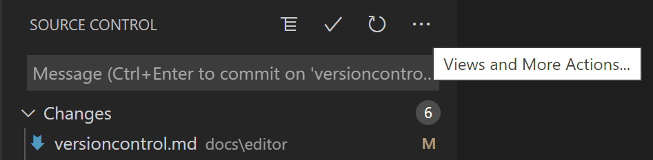

# Guide to GitHub

There are 2 ways to commit to github, using github website directly to add and edit files, or using Visual Studio Code to commit and push to github

## guide to Visual Studio Method

This is a good link to understand how to use git in visual studio code

https://code.visualstudio.com/docs/sourcecontrol/intro-to-git

Download git from this link and install using default parameters

https://git-scm.com/downloads


Ensure that git is enabled as shown above

``` 
console git config --global user.name "yourusername"
git config --global user.email "email@youremail.com"
```

follow these commands to set the username and email of the user in git in VScode

```
git config --global --list
```




When saving a version of the code to git, make sure to add a message to identify the version


Then check the branch that you are currently on. This can be seen at the bottom of the left hand side. Click on it to see the different branches.

checkout to the correct branch, and clone the repository to initialize your own local repository. Make sure to add your own branch, or change to the branch that you want to add to.
